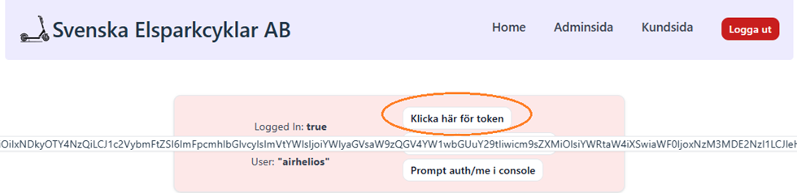
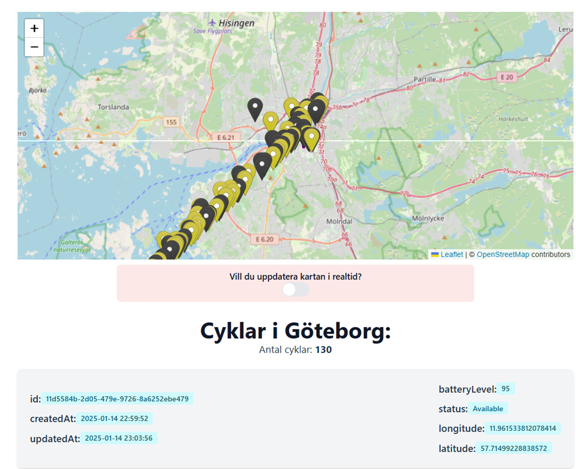

# Introduction
This web interface was developed to meet the administration task requirements in the course  [DV1676 at BTH](https://dbwebb.se/kurser/vteam-v1). A web frontend solution was developed for an mobility/electric scooter company.

The solution was built using React.js and TypeScript, with Tailwind CSS for design. It relies heavily on Flowbite components, and modules such as Redux, React Router DOM, and React Toastify. Leaflet/React-Leaflet, are also used. React Testing Library along with Jest was used for testing.
OAuth through GitHub is used for authentication.

# Introduction
The frontend solution is deeply connected to the [backend](https://github.com/KarlComSe/SvenskaElsparkcyklarAB/tree/development/backend). 
1)	Clone the main repo from here [SvenskaElsparkcyklar AB](https://github.com/KarlComSe/SvenskaElsparkcyklarAB/)
2)	Follow backend instructions from [here](https://github.com/KarlComSe/SvenskaElsparkcyklarAB/tree/development/backend)
3)	Adjust config file (`frontend\src\helpers\config.tsx`) with regards to Github authentication.
4)	From the frontend folder: `npm install`
5)	From the frontend folder: `npm run dev`
6)	You can now access the web interface on `localhost:5173`
7)	Unit tests are run with `npm test`

# Manual
## Admin
**Get token to interact with API, directly**

**Get lists over all bikes and zones in all cities**

**Get all bikes and zones drawn out on maps and track all bikes in real time**

**Get lists of and manage users**

